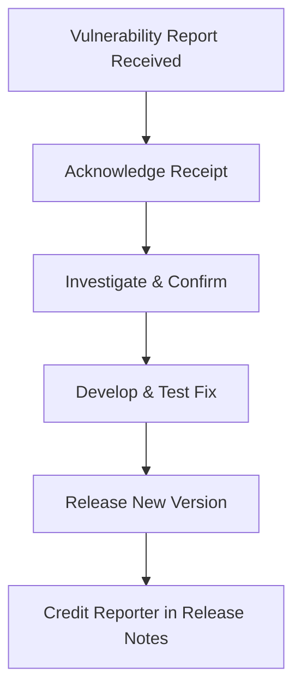

# Security Policy

## Reporting a Vulnerability

I take the security of this project seriously. If you believe you have found a security vulnerability, please report it
to me responsibly.

**Please do not report security vulnerabilities through public GitHub issues.**

Instead, please use the
[GitHub Private Vulnerability Reporting](https://docs.github.com/en/code-security/security-advisories/working-with-repository-security-advisories/configuring-private-vulnerability-reporting-for-a-repository)
feature through [Security Advisories](https://github.com/nikosavola/karoo-ext-testing/security/advisories), or contact
@nikosavola directly.

### Scope

These artifacts are test and debug tooling and are not meant to ship in a release APK. The appstore module stands in for
the Karoo system app's package name, so a report about it being packaged into a release build, or about the fakes
exposing a service outside a debug fixture, is in scope.

### What to include in a report

To help me understand and fix the issue, please include as much information as possible:

- A description of the vulnerability and its potential impact.
- Steps to reproduce the issue (a minimal working example is highly appreciated).
- Any potential mitigations you've identified.

### Process

